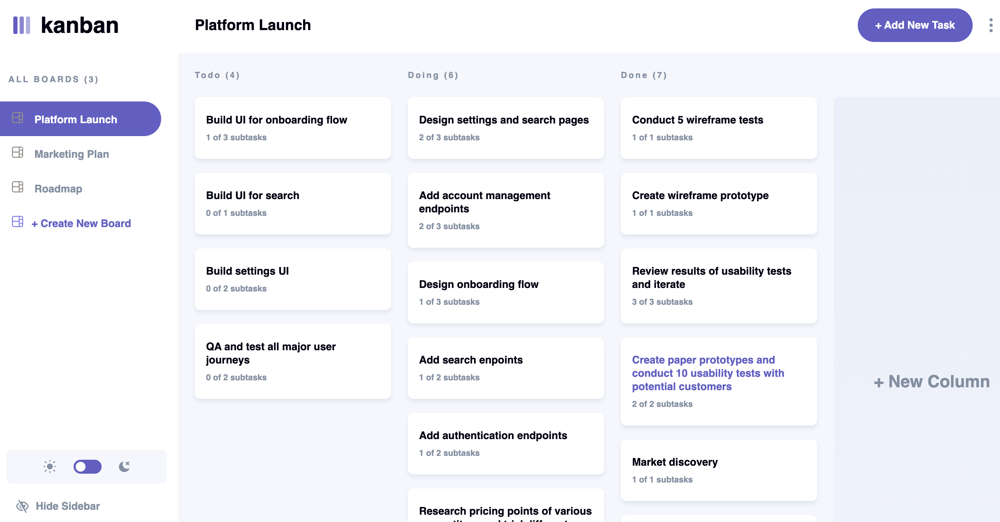

# Frontend Mentor - Kanban task management web app solution

This is a solution to the [Kanban task management web app challenge on Frontend Mentor](https://www.frontendmentor.io/challenges/kanban-task-management-web-app-wgQLt-HlbB). Frontend Mentor challenges help you improve your coding skills by building realistic projects. 

## Table of contents

- [Frontend Mentor - Kanban task management web app solution](#frontend-mentor---kanban-task-management-web-app-solution)
  - [Table of contents](#table-of-contents)
  - [Overview](#overview)
    - [The challenge](#the-challenge)
    - [Screenshot](#screenshot)
    - [Links](#links)
    - [Built with](#built-with)
    - [Useful resources](#useful-resources)
  - [Author](#author)

## Overview

### The challenge

Users should be able to:

- Experience the app's layout optimized for their device's screen size.
- Create, read, update, and delete boards and tasks.
- Receive form validation feedback when creating or editing boards and tasks
- Mark subtasks as complete and move tasks between columns
- Toggle the visibility of the board sidebar.

Expected Behaviour:

- Boards
  - Selecting a different board from the sidebar to switch to the another.
  - Clicking "Create New Board" in the sidebar opens the "Add New Board" modal.
  - Selecting "Edit Board" from dropdown opens "Edit Board" modal for making changes.
  - Columns can be added and removed in the Add/Edit Board modals.
  - Deleting a board removes all columns and tasks, with a confirmation prompt required.
- Columns
  - A board needs at least one column before tasks can be added. If no columns exist, the "Add New Task" button in the header is disabled.
  - Clicking "Add New Column" opens the "Edit Board" modal to add.
- Tasks
  - Adding a new task places it at the bottom of the appropriate column.
  - Updating a task's status moves to the corresponding column. 

### Screenshot

### Links

- Live Site URL: [link](https://da9104.github.io/react-kanban-board/)

### Built with

- Semantic HTML5 markup
- CSS
- Flexbox
- Mobile-first workflow
- [React](https://reactjs.org/) - JS library
- [Redux](https://redux.js.org/) - State management tool
- Github pages - Deploy

### Useful resources

- [How to create a toggle switch](https://www.w3schools.com/howto/howto_css_switch.asp) - Helped me create the theme toggle switch.
- [Have an onclick event fire only on parent and not it's children](https://stackoverflow.com/questions/9183381/how-to-have-click-event-only-fire-on-parent-div-not-children) - Helped me with closing modals when clicking outside the modal content container.
- [Package for using media queries in React](https://www.npmjs.com/package/react-responsive) - Helped me with rendering elements conditionally based on the window size

## Author

- Website - [Dami K](https://github.com/da9104/)